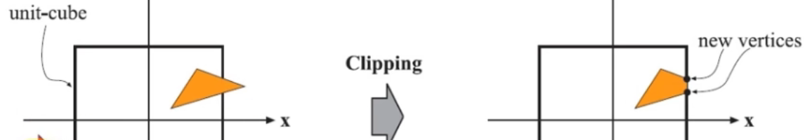

# # 应用阶段

## ## **1.输入基本场景数据**

​		* **场景中物体数据**

​			--物体变换数据：位置，旋转缩放等（unity中的tranform）

​			--物体网格数据：顶点位置，UV贴图，法线，切线等

​		* **摄像机数据**

​			--位置，方向，远近裁剪平面

​			--正交/透视（视场角FOV）

​			--视口比例/尺寸等

​		* **光源及阴影数据**

​			--设置光源：方向光的颜色和方向；点光的颜色，位置范围和衰减系数；聚光的颜色，位置，方向，内外圈锥角等

​			--设置阴影：是否需要阴影，判断该光源可见范围内是否有可投射阴影的物体；阴影参数，对应光源序号，阴影强度，级联参数，			深度偏移，近平面偏移等

​			--逐光源绘制阴影贴图：近平面偏移，逐级联

​		* **其它全局数据**

## **2.加速算法，粗粒度剔除**

​		* **可见光裁剪**

​		* **可见场景物体裁剪**

​			--八叉树；BSP树；K-D树；BVH包围盒等		

 		

## 3.设置渲染状态，准备渲染状态

​		* **绘制设置**

​			--着色器；合批方式（GPU instance；动态批处理）

​		* **绘制顺序**

​			--相对摄像机的距离排序

​			--材质RenderQueue排序

​			--UICanvas

​		* **渲染目标**

​			--RenderTexture

​			--FrameBuffer（帧缓存）

​		* **渲染模式**

​			--unity的成像渲染和延迟渲染 

## 4.调用DrawCall，输出渲染图元到现存，让GPU处理 

​		* **顶点数据**

​			--位置，颜色，发现，纹理UV坐标，其它顶点数据等

​		* **其它数据**

​			--MVP变换矩阵

​			--纹理贴图

​			--其它数据

* **应用阶段还是在CPU上进行，从下一阶段开始就在GPU上进行了**

# 几何阶段（Geometry Processing）

## 1.顶点着色

​		* **视图变换**

​			

																			
模型+视图+投影变换=MVP变换矩阵

​		* **顶点着色**

​			--计算顶点光照

## 2.可选项点处理

​		* **曲面细分**

​			--生成更多顶点，将网格，图元细分

​		* **几何着色器**

​			--基于图元操作，可能是一顶点，一个线段，两个顶点，也可能是多个顶点构成的连续线段，也可能是三个顶点的三角形

​			--通过给定图元生成更多图元

## 3.投影（GPU自动完成）

 正交与透视

## 4.裁剪

​		* **视锥体裁剪（CVV）**

​		* **正面或背面剔除（可配置）**

​		* **OPENGL中，xyz坐标都是[-1,1] ; D3D中，xy坐标范围是[-1,1] ，z坐标范围是[0,1] **

## 5.屏幕映射（Screen Mapping）

​		* **从连续到离散**

​		* **存在坐标系差异**

OPENGL的坐标原点在左下方；D3D的原点在左上方

# 光栅化阶段

## 1.三角形设置

## 2.三角形遍历（采样）

​	                       * **片元并不一定指像素，一个像素可能会是多个三角形的重叠，经过着色后再决定哪些保留，如何混合**

## 3.抗锯齿（Anti-Aliasing）

​		* **MSAA：多重采样**

​		* **SSAA：超级采样**

​		* **FXAA/TXAA：后处理技术，不在光栅化阶段**

​		* **TAA**

## 逐片元操作

​		

​		* **片元着色**

​		* **颜色混合**

​			--透明度测试（Alpha Test）

​			--深度测试（Depth Buffer Test）

​			--模板测试（Stencil Test）

​		* **目标缓冲区**

​			--FrameBuffer

​			--RenderTexture

# 总体流程图：

# 后处理阶段

# 补充：

​		**GPU架构特性：并行性好**

​		例如，在对同一物体的多个顶点进行光照处理或者着色计算时，这些顶点可能只是数据不同，但是它们的光照，着色算法以及几何运算方式都一样，这种情况下，将计算分配到GPU的不同工作单元上同时执行会获得巨大的效率优势。光栅化，逐片元操作同理。

