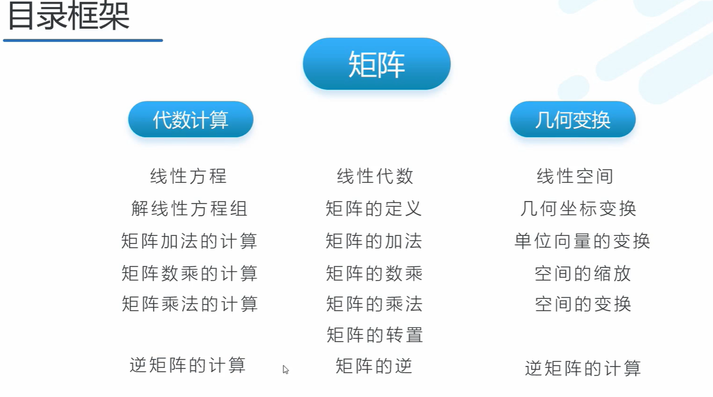
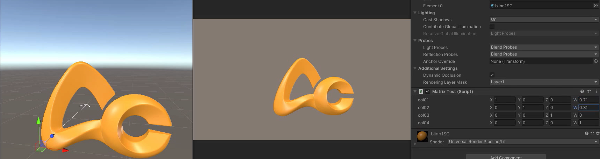
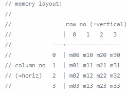

# 矩阵运算

矩阵基础部分略

## 关于行优先列优先问题

houdini与unity都是按照列优先的原则存储矩阵，刚好与我们在图形学中的学到的矩阵形成转置

以unity为例：

矩阵[1  0  0  0.71] 中，第一行第四列的叔由0变为0.71，第二行第四列的数由0变为0.81，可以看到，物体并未发生位移

​		 0  1  0  0.81

​		 0  0  1  0

​		 0  0  0  1	

列优先内存存储方式示意图：

