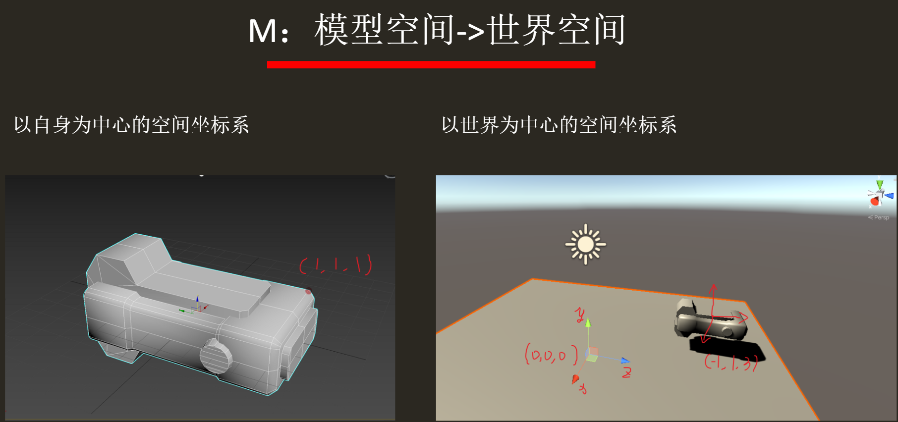
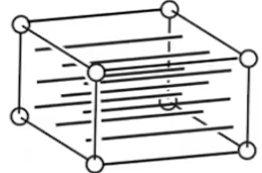
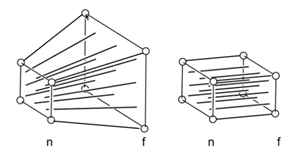

# MVP矩阵运算

## MVP矩阵的概念与意义

MVP分别是Model（模型），View（视图，观察），Projection（投影）三种矩阵。

作用：

* 将3D物体转化到2D平面

* 为各个空间（模型空间，世界空间等）的应用做准备

## 不同坐标的概念

顶点坐标起始于局部空间（Local Space），称为局部坐标（Local Coordinate），在经过矩阵变换后会变成世界坐标（World Coordinate），观察坐标（View Coordinate），裁剪坐标（Clip Coordinate），最后以屏幕坐标（Screen Coordinate）的形式结束

## Model模型变换

#### 意义

将模型从自身所属的模型空间坐标系，通过矩阵变换到世界空间的坐标系中。

* 模型空间是以模型自身中心为原点的空间坐标系，坐标描述的是**该模型上不同点之间的相对位置**，它仅能用于表示自身各部件间的距离关系

* 世界空间是以世界中心为原点的空间坐标系，以世界中心这样一个点为参考中心能够让我们描述**物体与物体之间的相对位置**，这才对应于我们自然语言中使用的“位置”这个词的含义，是我们所需要的位置信息。实际上，现实生活中人们描述位置时，正是以大地，地球为参考中心的

模型变换使得模型拥有了世界空间中的位置信息（坐标），我们能够知道它的每个点在世界空间中的位置，而不仅仅只知道它们每个点之间的相对位置

 

左图为3ds MAX中的模型空间，右图为unity中的世界空间

* 注：3ds MAX采用右手坐标系，ex轴代表左右，y轴代表前后，z轴代表上下
* 而unity采用左手坐标系，x轴代表左右，y轴上下，z轴代表前后
* DirectX，unity采用左手坐标系，3ds MAX，OpenGL采用右手坐标系

#### 如何实现

从模型坐标系变换到世界坐标系，有两点需要注意，很多教程里没有特别注明，导致了理解偏差：

——**我们预先拥有的坐标相关的数据只有模型空间的坐标信息**

——**变换到世界坐标系上后，模型上每一点的坐标并不是直接就知道的，因为变换到世界空间的哪个位置是人主导的，并不存在定则**

知晓这两点后，我们才能深入理解模型矩阵的内在含义：

对于不同的坐标需求，也就是不管我们要把模型放到世界空间中的哪个位置，我们都需要一个对应的模型矩阵来帮助完成转换操作。**特定模型矩阵使得特定模型转换到世界空间的特定位置**

在实际应用中表现为，模型本身在模型空间中的坐标位置经过矩阵变换后，刚好完美对应到了它被期望在的世界坐标上，原坐标在矩阵作用下变成了新的坐标，这也正是我们求解模型矩阵的方式

模型矩阵的变换分为三个步骤顺序：

1.缩放

2.旋转

3.平移

平移容易理解，可为什么还有缩放和旋转呢？

因为我们并不总是希望让模型只是“被拖入”世界空间，很多情况下我们需要让他更小一点，或者转一定的角度

**注：对应矩阵从右向左，顺序不能发生变换，否则结果会发生偏移（矩阵乘法没有结合律，用实例解释，矩阵乘法中旋转中心总是原点，所以先旋转后平移与先平移后旋转结果是不同的）**

Translation <- Rotation <- Scale

## View视图变换

#### 意义

将模型从世界空间转换到以摄像机为中心的观察空间坐标系中，由客观的三维世界转换到模拟人眼的观察空间中

视锥

#### 关于摄像机

为了模拟人眼，我们需要知道三个参数：

* 位置（e）
* 观察方向（g）
* 正负方向（t）：将手机的摄像头旋转180°，得到的图像自然也发生旋转，我们通过规定的方式定义正负

为此，我们引入了摄像机这个概念，并其使观察方向与正负方向对应于观察坐标系中的两条坐标轴

#### 如何实现

类似于从模型空间到世界空间，此处也是将坐标系从世界坐标变换为观察坐标。

但考虑到对世界坐标进行变换比较复杂（信息更多），而观察空间（更进一步认为，其实观察空间就是由摄像机决定的）则是自由可定义的，因此我们可以选择将观察空间引入世界空间，也就是将摄像机引入世界空间中，且出于方便计算和操作的原则将**摄像机的位置设在原点**，**将坐标系与世界坐标系对齐——观察方向与-Z对齐，从前往后看，正负方向与Y轴对齐，上方为正下方为负**

在此基础上，视图变换有两个步骤：

1.平移

2.旋转

平移使摄像机与世界中心重合，旋转使得坐标轴对齐，这里可以认为g，t 就是世界空间上的两个单位向量，那么旋转就是为了使g，t向量分别旋转到与坐标轴重合，也就是

**t -> y      g -> -z**

但考虑到这样做计算矩阵比较复杂，我们采取另一种巧妙的方式——求出使得y轴移动到 t 方向，z轴移动到 -g 方向的矩阵，再求其**逆矩阵**——这样就得到了目标视图变换矩阵中的旋转矩阵

取x，y，z轴上的单位向量x（1，0，0），y（0，1，0）和 z（0，0，1）

也就是求解

**y -> t    z -> g    x -> (g x t)**

   

用x，y，z三个单位向量去右乘R-1可以发现，刚好旋转到了g x t，t ，-g三个方向上

故其逆矩阵就是所求旋转矩阵

#### 为什么观察空间坐标系与世界空间坐标系相反

在观察方向g与-Z轴对齐，t与y对齐的情况下，为了让摄像机的另一条坐标轴与世界坐标的x轴对齐，自然就只能采取与世界空间中不同的坐标系了。unity世界坐标系为左手，那么它的观察坐标系自然就为右手了

## Projection投影变换

#### 意义

将模型从观察空间变换到裁剪空间，在裁剪空间中裁剪不可视部分

投影有两种方式：透视投影（Perspective Projection）与正交投影（Orthographic Projection）

Perspective Projection，通常用于3D游戏

Orthographic Projection，通常用于2D游戏

#### 正交投影

我们需要将这个长方体变换到[-1,1]的坐标内，再输出到屏幕平面上

#### 透视投影

视锥体，不包含物体

两平面分别是成像平面（屏幕）与该锥体的某远平面

透视投影是模拟人眼的一种投影方式，我们希望远处的物体被我们观察到，且仍然符合人眼近大远小的规律，也就是让世界空间中的三维物体在屏幕中以平面的方式显示出来，但是其成像符合近大远小规律

#### 如何实现

将视锥体内物体裁剪为长方体，再按正交投影的方式裁剪，输出

裁剪为长方体，再变换为正方体

