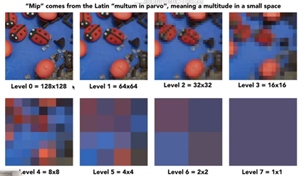
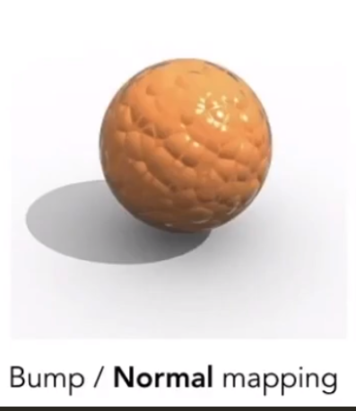

# 纹理基础

## 纹理的概念

宏观表现为一张图片

实际上是一种可供着色器读写的结构化存储方式，包含宽高以及对应RGBA数值的信息，也可以用来存储高度，纹理通道，法线等

## 纹理的作用

一种模拟物体表面的技术

比起直接建立一个完整的模型，我们不如直接在模型表面贴上一张“贴图”，这样就能节约很多成本

通过纹理，能够**减少建模工作量，节省存储空间，增加读取速度** 

其缺点是**牺牲了几何细节** 

## 纹理管线

类似于渲染管线，我们把纹理如何起作用的流程叫做纹理管线

模型空间位置=>投影函数=>纹理映射=>纹理坐标=>通讯函数=>新纹理坐标=>纹理采样(避免依赖纹理读取)=>纹理值

### 投影函数

* 与投影变换是完全不同的概念

将物体的顶点信息从模型空间投影到纹理坐标空间中，转化成纹理坐标，也就是uv坐标，通常这一步在俗称“展uv”的阶段中使用，随后讲投影的结果存储在顶点数据中

一般情况下我们是不用管投影函数的，但一些特殊的渲染情况使用特定的投影函数实现的，比如说环境渲染

### 纹理采样

纹理坐标（uv坐标）通过通讯函数进行平移，旋转，缩放，或者控制图像的应用方式之后，得到新的uv坐标

在这个新的uv坐标上，我们求可以通过纹理采样获取纹理值了

* 着色器中的纹理通常以Sample Variable也就是采样器变量的形式存在，这就是在代码里经常看到的Sample
* Sample 是uniform类型的变量，在处理不同的片元时，该量保持不变，一个Sample跟一个纹理对应

#### 依赖纹理读取

当使用Texture 2D或者类似的方式访问纹理的时候，只要像素着色器不是直接用顶点着色器传值，没有经过数值修改，就会需要依赖纹理读取

依赖纹理读取会对性能产生影响，所以我们尽量把这些相关的计算放在带点着色器完成

* 大部分实时渲染用到的都是图像纹理，用Lookup函数来索引值，小部分程序纹理涉及到的不是内存查找，而是函数计算，它们获取到的结果都是RGBA四个值，或者别的数据

流程图

模型坐标经过投影函数变换为uv坐标（0.32,0.29），假如这种纹理是256x256，那么让uv坐标乘以256得到(81,74)，随后通过采样的方式（插值，Bilinear，Bicubic，Mipmap，各向异性过滤）得到对应的纹理值

#### Wrap Mode

决定模型坐标被映射到了uv值[0.1]以外时的操作

OpenGL：“包装模式”（Wrapping Model）

Directx：“纹理寻址模式”（Texture Addressing Mode）

 Repeat               Mirror               Clamp               Border

* 中间图像为原纹理图像，对应uv值[0,1]，周围的图像就是对纹理进行拓展的操作，拓展后超出[0,1]的部分也能采样获取纹理值了。此处有四种拓展方式

#### Filter Mode

 最近邻                     双线性插值                  立方卷积

此处详见GAME101课程，当纹理过小或过大都要相应的方式解决问题

对于纹理过大时

像素点之间变化对应的纹理变化频率过高，发生走样问题（Aliasing），产生摩尔纹，所以可以采用反走样的方法处理

* 提高采样频率，可以使用Bilinear和Bicubic，但对于一些大很多倍的纹理这样程度采样频率的提升显然不够

* 减少纹理变化频率，可以使用Mipmap

  

Mipmap将原纹理一层层的缩放

Mipmap存在的问题就是过度模糊，我们使用各向异性过滤（Anisotropic Filtering）来部分解决这个问题

像素的映射范围是长条甚至是倾斜的

要解决斜条的映射，我们还有EWA过滤，用椭圆逼近

对于纹理过小时

像素点之间变化对应的纹理变化频率过过低，直接映射会使得图像变得模糊，此时使用Bilinear，Bicubic就非常合适

### CPU渲染优化常见方式--纹理图集/数组

当纹理显示到屏幕上时，需要CPU和GPU一起协作完成

为了让CPU和GPU并行工作，就需要一个命令缓冲区

DrawCall渲染队列，命令缓存区的一种命令

当CPU需要GPU做渲染工作时，就会把指令放入渲染队列，让GPU一条条的执行

每次调用DrawCall之前，CPU会向GPU发送提交很多内容，比如数据，状态等，这个阶段CPU需要完成很多工作，一旦完成，GPU就会开始渲染。但GPU渲染速度时非常强的，所以往往CPU提交速度是要慢于GPU渲染速度，当DrawCall命令过多时，CPU会画大量的时间在提交上。

降低这些提交时间的最常见的方式就是纹理图集，纹理数据以及无约束纹理，避免渲染时频繁改变纹理所带来的消耗

纹理图集与纹理数据

### GPU渲染优化常见方式--纹理压缩

减少了资源在CPU中进行解压缩的过程

减小了包体大小，减少了数据量级，减轻了带宽计算的压力

内存的使用效率更高

### 纹理的其它应用

#### 立方体贴图CubeMap

用六个二维纹理构成一个纹理立方体

当我们对立方体纹理进行采样时，所用到的纹理坐标是三维的，被视为从中心点出发的一个向量，对应于某个面上的某个点

常见应用：环境贴图

#### 凹凸贴图Bump Mapping

在不增加顶点的情况下，通过改变几何体表面各点的法线，使本来是平的东西看起来有凹凸的效果

计算的时候不是用的顶点的原始法向量，而是从高度图找到的扰动修改得到的法向量，再经过光强计算

整个过程我们并没有真正改变顶点的高度，而是定义了一个虚拟的高度

#### 位移贴图Displacement Mapping

凹凸贴图是模拟，虚假的移动。而位移贴图是真的把顶点作了位置的移动

