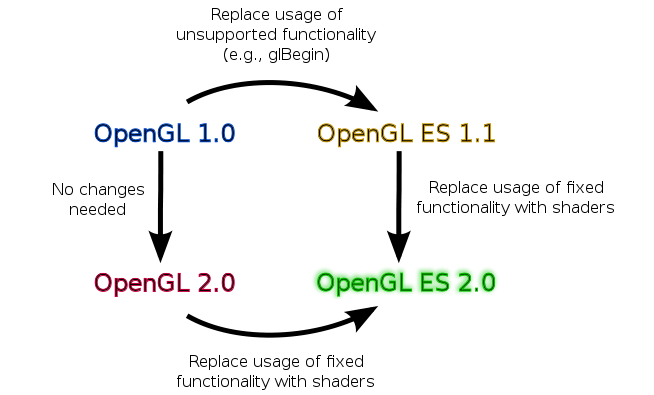

# 基础概念

**应用端**：

​	即我们自己的程序端。相对于opengl es，我们属于应用端

**图元**：

​	要渲染的几何物体，或者形状。比如要渲染一个正方形的图片，就是一个图元，要渲染两条直线，这两条直线也是图元

**纹理**：

​	通俗点，可以理解为一张图片，在opengl es中纹理就是图片的另外一种叫法

**纹素**（TEXEL）：

​	纹理的基础单元，可以理解为纹理的像素，但跟像素不是一个概念

**顶点数组**

​	顶点指的是组成图元的各个顶点的坐标数据(在3D笛卡尔坐标中即x,y,z坐标)，这些坐标数据可以一起存到一个内存数组中，这个数组就叫做顶点数组

**顶点缓冲区**

​	在显存中专门分配一块显存来存储这个顶点数组，这个显存就称为顶点缓冲区


**顶点着色器**

**片元着色器**


## DirectX ,OpenGL,OpenGL ES,Vulkan

Khronos 创造了OpenGL 微软定创造了DirectX 

手机端,不管是 iOS 还是 Android,都是支持 OpenGL ES。

Windows 系统支持 DirectX 和 OpenGL

Linux/Mac(Unix)系统支持 OpenGL。




### Khronos Open Standards for Graphics and Compute


***


### OpenGL ES

相比于 OpenGL ES 1.x 系列的固定功能管线，OpenGL ES 2.0 和 OpenGL ES 3.0 都是可编程图形管线。开发者可以自己编写图形管线中的 顶点着色器 和 片段着色器 两个阶段的代码。


**OpenGL ES 2.0：**


模型准备 -> 顶点着色器 -> 图元重组 -> 光栅化 -> 片元着色器 -> 三种测试 > Framebuffer


**OpenGL ES 3.0：**


各种缓存 -> 顶点池 -> 顶点着色器 -> Feedback -> 光栅化 -> 片元着色器 -> 逐片元渲染 -> Framebuffer 


#### OpenGL ES 3.0


##### 与以往版本的不同点


* 1.兼容性

OpenGL ES 3.0 是向后兼容 OpenGL ES 2.0 的。也就是说使用 2.0 编写的应用程序是可以在 3.0 中继续使用的。

* 2.新特性

采用阴影贴图、体渲染（volume rendering）、基于 GPU 的粒子动画、几何形状实例化、纹理压缩和伽马校正等技术的重要功能在 2.0 中都不具备。3.0 将这些功能引入，同时继续适应嵌入系统的局限性。

* 3.渲染管线

3.0 中移除了 Alpha 测试 和 逻辑操作（LogicOp） 两部分，这两部分存在于 OpenGL ES 2.0 和 OpenGL ES 1.x 中。

移除 Alpha 测试 是因为片元着色器能够抛弃片元，因此 Alpha 测试可以在片元着色器中进行。

移除 逻辑操作（LogicOp） 是因为它很少被使用。


***


##### 3.0中的着色器脚本编写


* 1.版本声明

**必须在着色器脚本中使用 #version 300 es 声明为指定使用 OpenGL ES 3.0 版本。例如：**

```c++
#version 300 es

layout(location = 0) in vec4 vPosition;

 

void main() {

	gl_Position = vPosition;

}
```

**不添加版本声明或者使用 #version 100 es 声明版本则指定使用 OpenGL ES 2.0。**

注： 以往 2.0 刚刚出来可编程的图形管线，所以版本声明为 #version 100 es ，后来为了使版本号相匹配，OpenGL ES 3.0 的 shader 版本直接从1.0 跳到了 3.0 。


* 2.输入输出

3.0 中新增了 in，out，inout 关键字，用来取代 attribute 和 varying 关键字。同时 gl_FragColor 和 gl_FragData 也删除了，片段着色器可以使用 out 声明字段输出。


* 3.变量赋值

3.0中可以直接使用layout对指定位置的变量赋值。例如：

```c++
# shader脚本中
layout (location = 1) uniform float a;
```


代码中，直接写上对应的 layout 的值就可以赋值

```c++
GLES30.glUniform1f(1, 1f);
```


而 2.0 中必须使用如下形式赋值：

~~~c++
GLES20.glUniform1f(GLES20.glGetAttribLocation(program, "a"), 1f)
~~~


***


##### 3.0新功能详解

OpenGL ES 3.0 加入了许多新的功能和特性，使得我们的开发更加灵活和便捷。内容摘自《OpenGL ES 3.0 编程指南》一书，主要有：纹理，着色器，几何形状，缓冲区对象，帧缓冲区


###### 纹理

（1）sRGB纹理和帧缓冲区——允许应用程序执行伽马校正渲染。纹理可以保存在经过伽马校正的sRGB空间，在着色器中读取时反校正到线性空间，然后在输出到帧缓冲区时转换回sRGB伽马校正空间。通过在线性空间中正确地进行照明和其它计算，可能得到更高的视觉保真度。

（2）2D纹理数组——保存一组2D纹理的纹理目标。例如这些数组可以用于执行纹理动画。在2D纹理数组出现之前，这种动画一般通过在单个2D纹理中平铺动画帧并修改纹理坐标改变动画帧来实现。有了2D纹理数组，动画的每个帧可以在数组的一个2D切片中指定。

（3）3D纹理。一些OpenGL ES 2.0实现通过扩展支持3D纹理，而OpenGL ES3.0将此作为强制的功能。

（4）深度纹理和阴影比较——启用存储在纹理中的深度缓冲区。深度纹理的最常见用途是渲染阴影，这时深度缓冲区从光源的角度渲染，然后用于在渲染场景时比较，以确定片段是否在阴影中。除了深度纹理外，OpenGL ES 3.0可以在读取时比较深度纹理，从而在深度纹理上完成双线性过滤。

（5）无缝立方图。以往立方图渲染可能在立方图各面之间的边界产生伪像。在OpenGL ES 3.0中，立方图可以进行采样如过滤来使用相邻面的数据并删除接缝处的伪像。

（6）浮点纹理。OpenGL ES 3.0扩展了支持的纹理格式。支持并可以过滤半浮点纹理（16位），也支持全浮点纹理（32位），但不能过滤。

（7）ETC2/EAC纹理压缩。OpenGL ES 3.0中强制支持ETC2/EAC。ETC2/EAC的格式为RGB888，RGBA8888和单通道及双通道有符号/无符号纹理数据。纹理压缩的好处包括更好的性能以及减少GPU内存占用。

（8）整数纹理。OpenGL ES 3.0引入了渲染和读取保存为未规范化有符号或无符号8位、16位和32位整数纹理的能力。

（9）其它纹理格式。OpenGL ES 3.0还包含了对11-11-10 RGB浮点纹理、共享指数RGB 9-9-9-5纹理、10-10-10-2整数纹理以及8位分量有符号规范化纹理的支持。

（10）非2幂次纹理（NPOT）。纹理现在可以指定为不为2的幂次尺寸。

（11）纹理细节级别（LOD）。现在可以强制使用用于确定读取哪个Mipmap的LOD参数。此外，可以强制基本和最大Mipmap级别。这两个功能组合起来，可以流化Mipmap。在更大的Mipmap级别可用时，可以提高基本级别，LOD值可以平滑地增加，以提供平滑的流化纹理。这一功能非常有用，例如用于通过网络连接下载纹理Mipmap。

（12）纹理调配。引入新的纹理对象状态，允许独立控制纹理数据每个通道（R、G、B、A）在着色器中的映射。

（13）不可变纹理。为应用程序提供在加载数据之前指定纹理格式和大小的机制。在这样做的时候，纹理格式不可变，OpenGL ES驱动程序可以预先执行所有一致性和内存检查。通过允许驱动程序在绘制的时候跳过一致性检查，可以改善性能。

（14）最小尺寸增大。OpenGL ES 3.0支持远大于OpenGL ES 2.0的纹理资源。


###### 着色器

（1）二进制程序文件。在OpenGL ES 2.0中可以二进制格式存储着色器，但是仍需要在运行时链接到程序。在OpenGL ES 3.0中，完全链接过的二进制程序文件可以保存为离线二进制格式，运行时不需要链接步骤。这有助于减少应用程序的加载时间。

（2）强制的在线编译器。在OpenGL ES 2.0可以选择驱动程序是否支持着色器的在线编译，意图是降低驱动程序的内存需求，但是这一功能代价很大，开发人员不得不依靠供应商专用工具来生成着色器。在OpenGL ES 3.0中，所有实现都有在线着色器编译器。

（3）非方矩阵。支持方阵之外的新矩阵类型，并在API中增加了相关的统一调用，以支持这些矩阵的加载。非方矩阵可以减少执行变换所需的指令。例如执行仿射变换时，可以使用43矩阵代替最后一行为(0, 0, 0, 1)的44矩阵，从而减少执行变换所需的指令。

（4）全整数支持。支持整数（以及无符号整数）标量和向量类型以及全整数操作。有各种内建函数可以实现从整数到浮点数、从浮点数到整数的转换以及从纹理中读取整数值和向整数颜色缓冲区中输出整数值的功能。

（5）质心采样。为了避免在多重采样时产生伪像，可以用质心采样声明顶点着色器和片段着色器的输出变量

（6）平面/平滑插值程序。在OpenGL ES 2.0中所有插值程序均隐含地在图元之间采用线性插值。在OpenGL ES 3.0中插值程序可以显式声明为平面或者平滑着色。

（7）统一变量块。统一变量值可以组合为统一变量块。统一变量块可以更高效地加载，也可在多个着色器程序间共享。

（8）布局限定符。顶点着色器输入可以用布局限定符声明，以显式绑定着色器源代码中的位置，而不需要调用API。布局限定符也可以用于片段着色器的输出，在渲染到多个渲染目标时将输出绑定到各个目标。而且，布局限定符可以用于控制统一变量块的内存布局。

（9）实例和顶点ID。顶点索引现在可以在顶点着色器中访问，如果使用实例渲染，还可以访问实例ID。

（10）片段深度。片段着色器可以显式控制当前片段的深度值，而不是依赖深度值的插值。

（11）新的内建函数。引入了许多新的内建函数，以支持新的纹理功能、片段导数、半浮点数据转换和矩阵及数学运算。

（12）宽松的限制。大大放松了对着色器的限制。着色器不再限于指令长度，完全支持变量为基础的循环和分支，并支持数组索引。


###### 几何形状

（1）变换反馈。可以在缓冲区对象中捕捉顶点着色器的输出。这对许多在GPU上执行动画而不需要CPU干预的技术很实用，例如，粒子动画或者使用“渲染到顶点缓冲区”的物理学模拟。

（2）布尔遮挡查询。应用程序可以查询一个（或者一组）绘制调用的任何像素是否通过深度测试。这个功能可以在各种技术中使用，例如镜头眩光效果的可见性确定，以及避免在边界被遮挡的对象上进行几何形状处理的优化。

（3）实例渲染。有效地渲染包含类似几何形状但是属性（例如变化矩阵、颜色或者大小）不同的对象。这一功能在渲染大量类似对象时很有用，例如人群的渲染。

（4）图元重启。在OpenGL ES 2.0中为新图元使用三角形条带时，应用程序必须在索引缓冲区中插入索引，以表示退化的三角形。在OpenGL ES 3.0中，可以还是要特殊的索引值表示新图元的开始。这就消除了使用三角形条带时生成退化三角形的需求。

（5）新顶点格式。支持包括10-10-10-2有符号和无符号规范化顶点属性；8位、16位和32位整数属性；以及16位半浮点。


###### 缓冲区对象

   引入了许多新的缓冲区对象，以提高为图形管线各部分指定数据的效率和灵活性。

（1）统一变量缓冲区对象。为存储/绑定大的统一变量块提供高效的方法。统一变量缓冲区对象可以减少将统一变量值绑定带着色器的性能代价，这是OpenGL ES 2.0应用程序中的常见瓶颈。

（2）顶点数组对象。提供绑定和在顶点数组状态之间切换的高效方法。顶点数组对象实际上是顶点数组状态的容器对象。使用它们，应用程序可以在一次API调用中切换顶点数组状态，而不是发出多个调用。

（3）采样器对象。将采样器状态（纹理循环模式和过滤）与纹理对象分离。这为在纹理中共享采样器状态提供了更高效的方法。

（4）同步对象。为应用程序提供检查一组操作是否在GPU上完成执行的机制。相关的新功能是栅栏（Fence），它为应用程序提供了通知GPU应该等待一组操作结束才能接受更多操作进入执行队列的方法。

（5）像素缓冲对象。使应用程序能够执行对像素操作和纹理传输操作的异步数据传输。这种优化主要是为了在CPU和GPU之间提供更快的数据传输，在传输操作期间，应用程序可以继续工作。

（6）缓冲区子界映射。使应用程序能够映射缓冲区的一个子区域，供CPU访问。这可以提供比传统缓冲区映射更好的性能，在传统缓冲区映射中，必须使整个缓冲区可用于客户。

（7）缓冲区对象间拷贝。提供了高效地从一个缓冲区对象向另一个缓冲区对象传输数据的机制，不需要CPU干预。


###### 帧缓冲区

   增添了许多与屏幕外渲染带帧缓冲区对象相关的新功能

（1）多重渲染目标（MRT）。允许应用程序同时渲染到多个颜色缓冲区。利用MRT技术，片段着色器输出多个颜色，每个用于一个相连的颜色缓冲区。MRT用于许多高级的渲染算法，例如延迟着色。

（2）多重采样渲染缓冲区。使应用程序能够渲染到具备多重采样抗锯齿功能的屏幕外帧缓冲区。多重采样帧缓冲区不能直接绑定到纹理，但是可以用新引入的帧缓冲区块移动解析为单采样纹理。

（3）帧缓冲区失效提示。OpenGL ES 3.0的许多实现使用基于块状渲染（TBR）的GPU。TBR常常在必须为了进一步渲染到帧缓冲区而毫无必要地恢复图块内容时导致很高的性能代价。帧缓冲区失效为应用程序提供了通知驱动程序不再需要帧缓冲区内容的机制。这使驱动程序能够采取优化步骤，跳过不必要的图块恢复操作。这一功能对于在许多应用程序中实现峰值性能很重要，特别是那些进行大量屏外渲染的程序。

（4）新的混合方程式。OpenGL ES 3.0支持最大值/最小值函数作为混合方程式。


***


### 晓龙Adrene对应ES版本型号

**Adreno**是由[高通](https://zh.wikipedia.org/wiki/高通)开发的[SIP核](https://zh.wikipedia.org/wiki/IP核)[GPU](https://zh.wikipedia.org/wiki/GPU)并用于其自家的[SoC](https://zh.wikipedia.org/wiki/系统芯片)（芯片），该核心最初作为[BitBoys](https://zh.wikipedia.org/w/index.php?title=BitBoys&action=edit&redlink=1)（wiki词条：[BitBoys](https://en.wikipedia.org/wiki/BitBoys)）从事GPU开发工作。 

2006年，BitBoys被[ATI](https://zh.wikipedia.org/wiki/ATI)收购开设Imageon产品线。2006年[AMD](https://zh.wikipedia.org/wiki/AMD)收购[ATI](https://zh.wikipedia.org/wiki/ATI)。2009年1月，[AMD](https://zh.wikipedia.org/wiki/AMD)出售Imageon予[高通](https://zh.wikipedia.org/wiki/高通)[[1\]](https://zh.wikipedia.org/wiki/Adreno#cite_note-1)。随后，Imageon被更名为Adreno。 

**也就是我们常说的骁龙手机端GPU框架**


这两个链接可以查看对应的手机芯片支持的OpenGL es支持的版本

https://zh.wikipedia.org/wiki/Adreno

​	[https://zh.wikipedia.org/wiki/%E9%AB%98%E9%80%9A%E9%A9%8D%E9%BE%8D%E5%85%83%E4%BB%B6%E5%88%97%E8%A1%A8#Snapdragon_888](https://zh.wikipedia.org/wiki/高通驍龍元件列表#Snapdragon_888)


**重点：Adreno	320开始支持OpenGL ES 3.0**


***

### Vulkan

Vulkan是一个跨平台的2D和3D绘图应用程序接口（API）。相对于 OpenGL，Vulkan大幅降低了 CPU 在提供重要特性、性能和影像质量时的“API 开销” （CPU 在分析游戏的硬件需求时所执行的后台工作），而且可以使用通常通过 OpenGL 无法访问的 GPU 硬件特性。Vulkan能够支持深入硬件底层的控制，为 Windows和 Linux带来更快的性能和更高的影像质量。Vulkan的API 还提供超高的OS兼容性、渲染特性和硬件效率。
