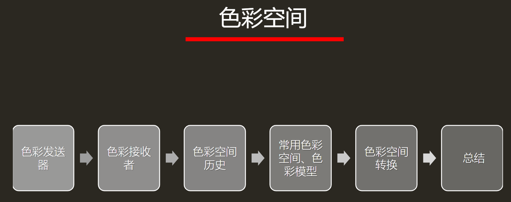
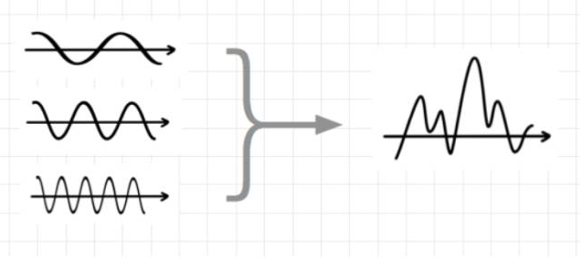
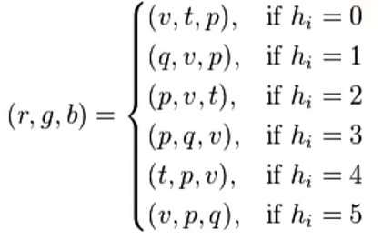

# 色彩空间

## 色彩发送器

光源是出生点，光源发射出光线（光波），光线通过直射反射折射等路径最终进入人眼

但人眼接收到光线后，人眼的细胞产生了一系列化学反应

由此把产生的信号传入大脑，最终大脑对颜色产生了认知感知

### 1.光传播的要素

#### **光源**

光源就是产生光的物体，如果没有光，我们就无法在黑暗中看到色彩。

光在没有进入我们的眼睛前，我们对它的认知是一种波长与能量分布。

可见光范围

我们所说的光就是指波长在可见光范围内的波

#### **能量分布**

光线是一种波，所以拥有能量，同时有对应的波长。所以我们可以通过波长来描述某种光线

多个波长混合形成的波形

那么我们j描述色彩时就可以使用波长，不过这样描述会变得非常不直观，我们无法用波长简单描述色彩

于是人们发明了一个叫做分光光度计的东西

#### **分光光度计**

光线能量集中在了550nm附近（图中绿色部分）

分光光度计用于描述光线的具体能量强度，通过分光对区间波长进行感应与测量，最后得知光谱的分布。

步骤：

1.混合波长构成光线，拆分光线后形成单一波长的光线 

2.测量单一波长光的实际所含能量

#### **光的传播**

光经过不同路径进入人的眼睛中

直射光：光源直射眼睛 

折射光：光源穿过物体进入眼睛

反射光：光源经过物体表面反射进入眼睛

光在物体间传播时，会被物体吸收部分能量，发生能量的损耗

人眼的所看到物体的颜色，其实是光线经过物体发生能量损耗之后，其剩下的部分进入眼睛表现出颜色

也就是一个黑色的物体，它表面是几乎吸收了所有颜色的光，所以我们看不见颜色

而白色的物体几乎都不吸收，导致光线几乎没有能量损耗就进入了人眼

****

### 2.色彩的接收者

#### 相对亮度感知

人对亮度的感知是会变化的

在某些阴暗的环境下，点亮一盏灯，这时人眼就会觉得灯非常亮。如果同时点亮1000盏灯，反而觉得只是原来10倍的亮度，对亮度的认知从0~1 变成0~10

#### 人眼HDR

HDR的概念等到后面再详解

人眼既可以分辨出高亮度的云彩的不同层次区别，又可以分辨出阴影中物不同物体的异同。

但是人眼的能力并不能保证这两个功能同时生效。

#### 人眼感光细胞分布

人眼简单可以把感知色彩的细胞分为两大类，杆状细胞与椎状细胞

杆状细胞负责感知亮度对亮度特别的敏感，只要有5~14个光子打到杆状细胞就会产生神经信号，这也可以解释为什么闪光弹能让人致盲，一部分原因就是因为光实在太亮，直接干涉了人眼最敏感的感光细胞

锥状细胞负责感知色彩，被细分为L细胞，M细胞，S细胞

三者感知的光波长不同，SML分别（主要）对应蓝绿红

#### 人眼的本质

接受外部光线输入，转化成神经信号传给大脑

***

## 色彩空间的历史

#### 19世纪关于色彩的猜想

1.人们有100多种感受颜色的细胞

2.人们有三种细胞，分别是RGB三种感色细胞

3.人们有三种细胞，分别是黑白，红绿，黄蓝感色细胞

其中的2和3两种猜想都成为了当下的主流色彩视觉模型，也称之色彩模型

#### 1905Munsell色彩系统

美国艺术家 Albert Henry Munsell利用自己的艺术特长，最早提出了一个色彩系统，后来在1930年被优化改良

Munsell通过很多色卡来描述色彩，下面旋转角度的是色相，Munsell垂直的是亮度，从圆心到外部是Munsell饱和度。 人们凭借自我主观意识认知与区分色彩就是HSL(色相饱和亮度)，这套系统没有过多的物理科学在其中，更多的是一种艺术家的理解与归纳总结规范

这套系统优化了色彩的描述，因为最早的色彩描述方式就是：

 \- 五彩斑斓的黑（好吧现在也在用）

\- 比猴子的屁股还红

\- 比这个颜色还要跟深一点

这一类模糊的描述难以理解，难以表达，而用了这个色彩系统之后，一个颜色可以通过数值的方式入

H = 1.6YR,V = 6.3,C = 3.9 来描述而且也不会有任何的描述与理解偏差

方便起见，就以此系统为依据，为一些常用色彩制作了色卡，用一个个色卡描述色彩非常方便。

#### 1931 CIE 1931 RGB Color Specification System

CIE机构的科学家们在上述色彩系统的基础上，于1931年建立了另一套色彩系统， 以完全客观地量化色彩

色彩匹配方案：

CIE把所有可视波长的光线作为测试光挨个测试了一个遍，最终的到了三条曲线

我们发现435.8~546.1 nm这段波长中的红色基色强度是负数。这虽然物理正确，但是一点也没有科学的美感，于是我们进行了归一化，保证色彩在-1~1之间

最终通过计算出rgb的基色的强度在当前混色强度的所占比例

这样计算后， r'g'b'都是在-1~1之间， 那么我们发现r'+g'+b'=1,那么就可以通过其中两个已知数计算出另一个的强度

图像可视化：

在对数值归一化之后，两个变量就可以代表色彩了，于是我们就通过r' g'这两个参数作图画出了一个二维空间，x轴是r'，y轴是g' 

 现在我们可以把任何可见光通过图像的一个点的坐标来表示说明。

#### 1931 XYZ Color Specification System

CIE1931RGB色彩系统已经不错了，但是存在负数，这在计算上非常的麻烦，比如写个乘法，得先计算是正数还是负数。

于是人们就用数学的方式做了一个新的色彩空间。

XYZ色彩空间就是一个中转站，主要目的就是简化计算。

最终为了方便又进行转换后，效果就是色域马蹄图

人眼可见范围表示， 但是我们发现图像上面好像没有亮度于是我们就在归一化的基础上，把XYZ中的Y单独拿出来与xy一起组成了Yxy色彩空间 其中的Y表示亮度 xy表示色度

色欲马蹄图的3d显示效果

不足：

上述的XYZ色彩空间也不错，但是也有问题，就是色彩的分布不均匀，他们的分布色彩一些地方变化快一些地方又很慢，

#### 现代色彩空间

至少需要满足三项重要指标

* 色域（三个基色的坐标，形成三角形）

* Gamma（如何切分三角形，对色彩采样的方式，gamma=1是均匀切割，≠1是不均匀切割）
* 白点（色域三角形中心）

色域（三角形）与白点（中心点）

Gamma（=1）

* 注 ：sRGB的gamma值设定为≈2.2。从外向内切，切的区域又细变粗

***

## 常用色彩空间，色彩模型

色彩模型：使用一定规则描述（排列）颜色的方法

举例：RGB、CMYK、LAB

色彩空间举例：

​	CIE XYZ、 Adobe RGB、 sRGB、Japan Color 2001 Uncoated、US web Coated（后两个是基于CMYK模型建立的）

***

## 色彩空间转换

RGB2HSV:

HSV2RGB:

 

