# 模型与材质基础

## 图形渲染管线

蓝色部分表示可编程

## 模型实现原理

点连成线，线围成面组成多边形，这就形成了一个模型

### UV

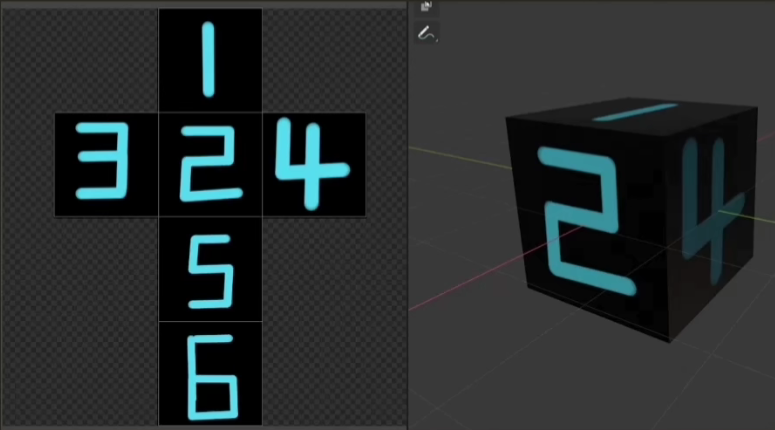

模型在三维坐标中的每个顶点都能与二维中的一个纹理坐标对应

因此每个顶点都能利用纹理坐标获取贴图所存储的信息

在建模软件里对模型展uv后，一个面上的点会映射到uv坐标中，范围都是[0,1]

通过顶点坐标与uv坐标的映射关系，我们能在SP，BodyPaint，PS等软件中制作贴图，比如漫反射贴图，法线贴图

***

## 模型包含的信息（obj文件）

一个模型文件包含模型的顶点信息（坐标），纹理坐标（对应的uv坐标），以及顶点法线。

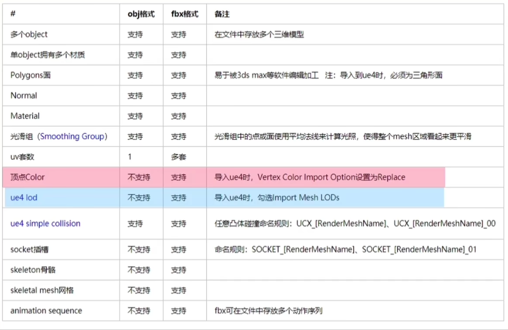

fbx格式支持顶点色（顶点的颜色信息，RGBA）

***

## 材质

在现实世界里，每个物体会对光产生不同的反应。比如，钢看起来通常会比陶瓷花瓶更闪闪发亮，木头箱子不会像钢制箱子那样对光产生很强的反射。每个物体对镜面高光也有不同的反应

有些物体反射光的时候不会有太多的散射（Scatter），因而产生一个较小的高光点

而有些物体则会散射很多，产生一个有着更大半径的高光点

## 光照传播类型

### 漫反射

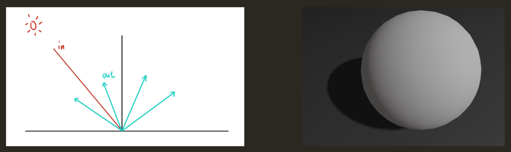

光向四面八方反射

漫反射是最容易模拟的模型。比如现实中的石头，水泥，砖块等

最简单的Lambertian模型简单粗暴地认为光线均匀反射

Diffuse = baseColor *LightColor * dot(LightDir , Normal)

### 镜面反射

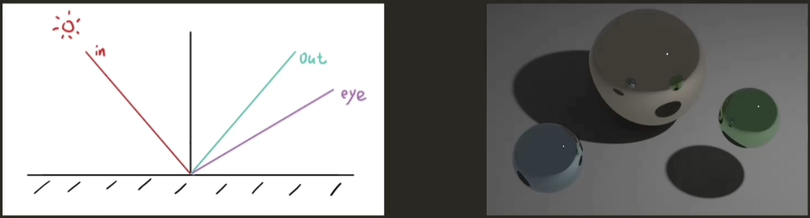

光滑镜面反射

镜面反射就是将入射光线根据表面法线进行反射，并且只有在反射方向有能量，其他方向能量均为0

Specular =  pow(saturate(dot(ReflDir,ViewDir)),32) * LightColor; 

### 折射

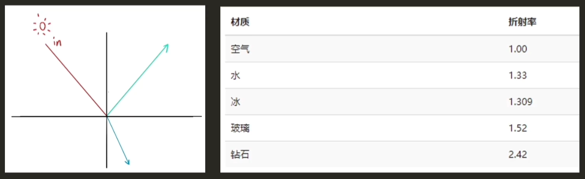

对于玻璃这种电介质，除了反射之外还会根据物体的折射率折射一部分光线进入物体之中

反射和折射能量的多少是根据菲尼尔定律决定

R = refract(View,Normal,ration);

ReflColor = tex2D(skybox,R);

### 粗糙镜面反射

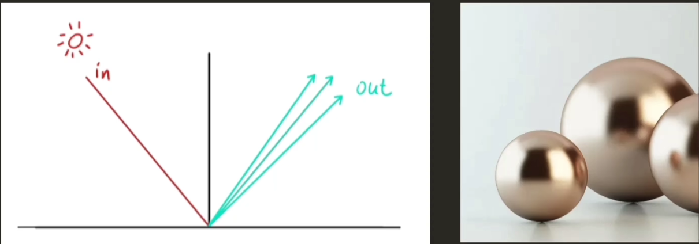

经过法线偏移较小，反射依然集中在一个区域，形成磨砂的质感

### 粗糙镜面折射

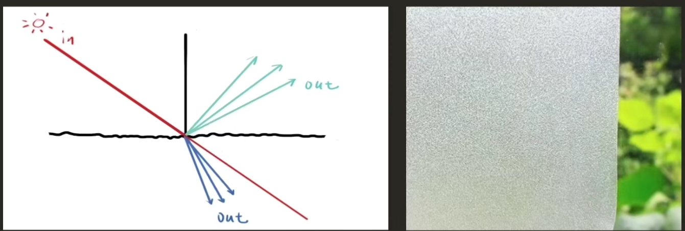

如各种毛玻璃

游戏引擎中，我们可以先获取其它物体渲染后的数据，将这些数据传入粗糙地面折射的shader中，采样数据，修改透明度，就能透过当前物体看到其背后的物体

### 多层材质

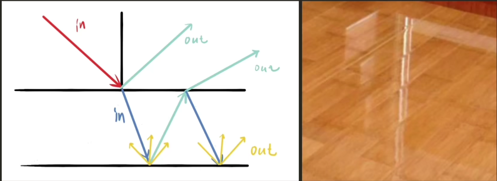

涂了透明油漆的木地板，浅水河

技能看见地板的纹路，又能看见油漆图层反射的上方物体的倒影

### 次表面散射

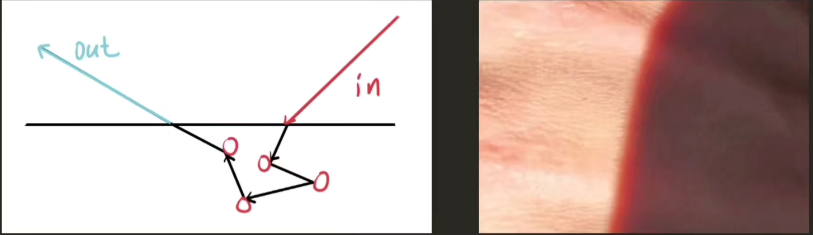

半透明的物体，部分光线在物体里多次折射又射出

如玉石，蜡烛，牛奶，皮肤

### 多层皮肤模型

把皮肤看成三层，油脂层，表皮层，真皮层

油脂层直接把光反射出去，所以皮肤上有高光

没有被散射的光通过折射进入子表面层，光进入这些层后部分被吸收（获得颜色）和散射，再从皮肤入射点附近的出射点射出。这个过程就产生了次表面散射的效果

***

## 改变材质表面

现实世界中不存在完美平滑的表面，一个模型顶点携带的法线也有限，因此需要对模型表面的法线进行扰动

其中一个方法是使用法线贴图。对漫反射，高光，折射的计算都需要法线参与，对法线作出调整，就能影响光照计算的结果

虽然材质特别重要，但是没有一个好的模型，依然不会有好的效果。有时候模型自身就能表现出金属感，布料感

而材质在好模型的基础上就能给人一个更加直观的感受。

***

##  模型数据在渲染中的作用

### 顶点动画

在顶点着色器中，修改模型的顶点位置，达到模型运动的效果

顶点动画需要一定数量的顶点，效果才会比较明显

一个顶点传入一个顶点着色器，顶点着色器控制顶点位置时所有的顶点都会进行一样的算法。

获取顶点UV坐标，控制移动的数值大小(UV 范围0-1)

### 纹理动画

在片段着色器中，修改模型的UV信息，使得采样贴图时，发生位移而产生运动效果

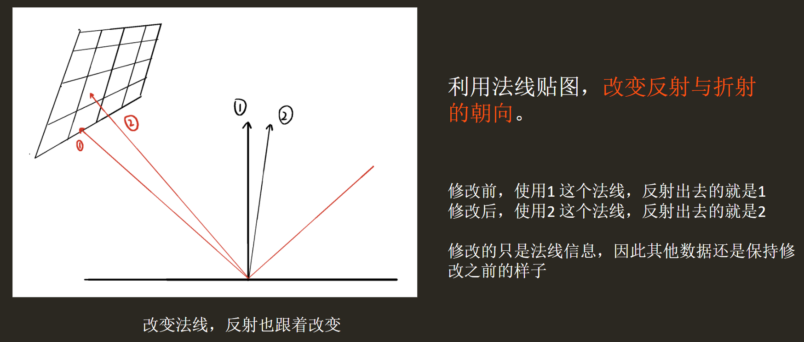

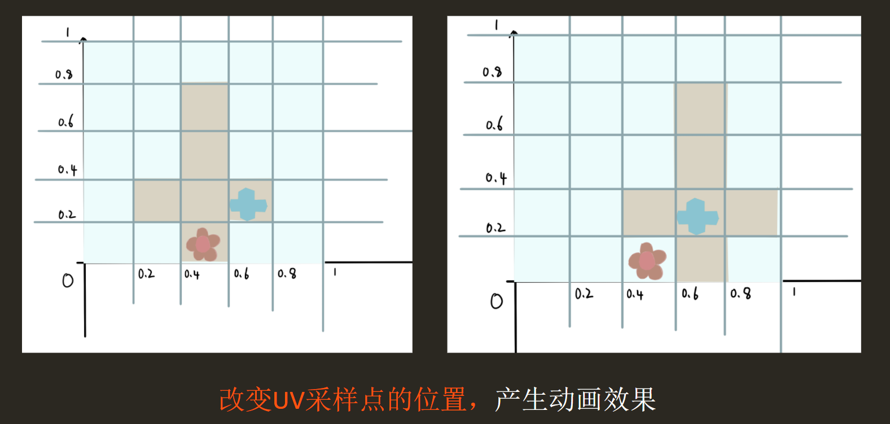

### 顶点色

在渲染时，影响输出结果，控制颜色范围

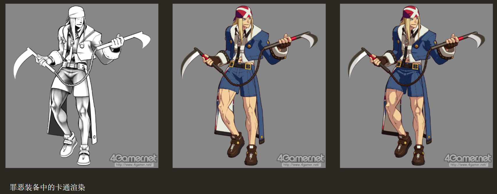

***

## 顶点法线与面法线

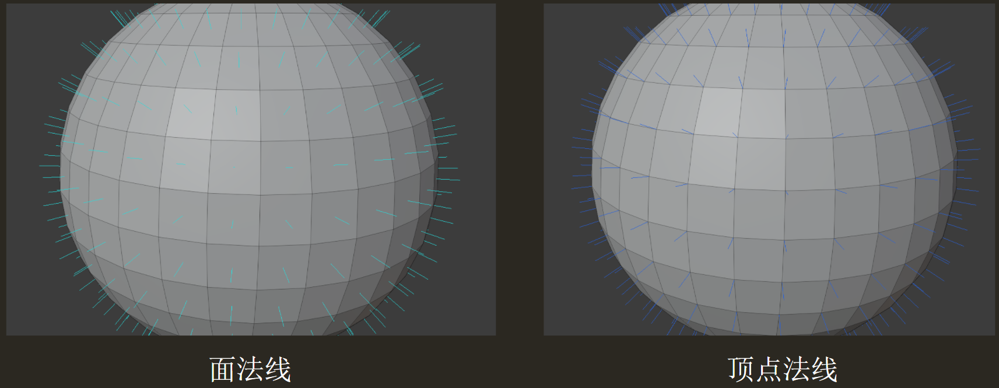

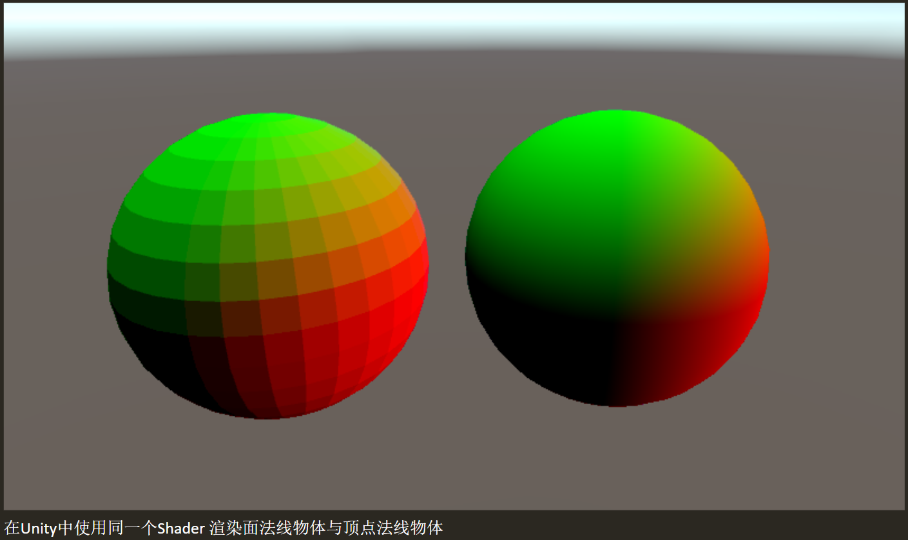

对于未使用平滑时的面法线，三角形三个顶点共用一个法线，那么插值时，因为三个顶点的法线相同，所以插值的结果相同。

对于使用平滑后的顶点法线，一个顶点一个法线，三角形三个顶点的法线也就不相同，插值结果也会不同。

45
