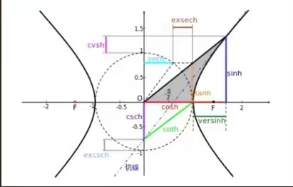
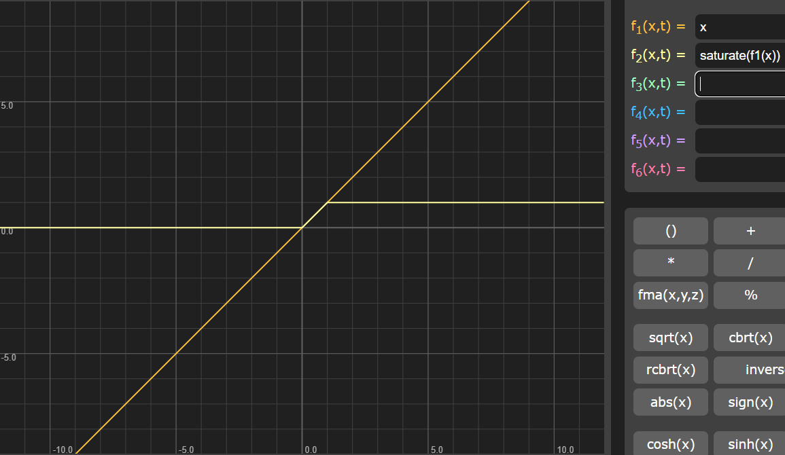
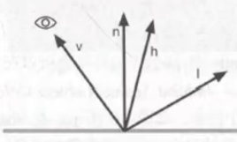

# HLSL常用函数介绍

## HLSL概念

微软公司开发的高阶着色语言，只能于Direct3D上使用，是与GLSL相抗衡的作品

## HLSL基本内容

微软官方文档：**https://docs.microsoft.com/en-us/windows/win32/direct3dhlsl/dx-graphics-hlsl-intrinsic-functions**

### 基本数学运算

max(a,b) 返回较大的那个

min(a,b) 返回较小的那个

mul(a,b) 两数相乘，常用于矩阵运算

abs(a) 返回输入值的绝对值

round(x) 返回与x最近的整数

sqrt(x) 返回指定值的平方根

rsqrt(x) 返回指定值的平方根的倒数

degrees(x) 转换成弧度

radians(x) 将角度转为弧度制

noise(x)  噪声函数

噪声图

噪声函数：将噪声图的每一个(x,y)二维向量对应的值（黑1百0）设置为随机，得到一个随机的图像

### 幂指对函数

pow(x,y) x的y次幂(x和y均可为自变量或具体的数)	即xy

//ldexp(x,exp) 返回x与2的exp次方的乘积		即x*2exp

exp(x) 返回以e为底的指数函数			即ex

exp2(value x) 返回以2为底，x为幂的指数

log(x) 返回指定值的以e为底的对数			即ln x

log10(x) 求以10为底的对数				即log10x

log2(x) 求以2为底的对数				即log2x

frexp(x,out exp) 把浮点数 x 分解成尾数和指数，返回值是尾数，用out 关键字指定的exp参数被赋值为指数。exp不需要初始化 

(如果x参数为0，则此函数的尾数和指数均返回0)

### 三角函数与双曲线函数

asin(x) 返回输入值的反正弦值

acos(x) 返回输入值反余弦值

atan(x) 返回输入值的反正切值

atan2(y,x) 返回y/x的反正切值

sin(x)、cos(x)、tan(x)、tan(y,x)

sincos(x,out s ,out c) 返回x的正弦值和余弦值

用单位圆定义的双曲线

sinh(x) 返回x的双曲正弦值        即0.5*(ex-e-x)

cosh(x) 返回x的双曲余弦值       即0.5*(ex-e-x)

tanh(x) 返回x双曲正切值

### 数据范围类

ceil(x) 返回>=x的最小整数

step(x,y)x<=y为1，否则为0

floor(x) 返回小于或等于x的最大整数

saturate(x) 返回将x钳制到0和1之间的值

clamp(x,min,max) 把x限制在[min, max]范围内，小于返回min，大于返回max

frac(x) 返回x部分的小数

fmod(a,b) 返回a/b的浮点部分

modf(x,out ip)  将值x分为小数和整数部分(各部分符号与x相同) ，ip返回整数部分，整体返回小数部分

lerp(a,b,s) 按照s在a到b之间插值，即返回 （x * (1-s)+y * s），通常让s不断增大，使插值从x接近y，实现渲染管线里的插值作用

smoothstep(min,max,x)  如果x在[ min，max ]范围内，则返回介于0和1之间的平滑Hermite插值;使用smoothstep HLSL内在函数在两个值之间创建

平滑过渡。例如，使用此功能平滑地混合两种颜色

### 类型判断类

all(x) 确定指定量的所有分量是否均为非零，均非零则返回true，否则返回false（可用于处理由浮点型、整型、布尔型数据定义的标量、向量或者矩阵） 

clip(x) 如果输入值小于零，则丢弃当前像素 常用于判定范围(不仅仅针对0,返回值为void)

常用于测试alpha，如果每个分量代表到平面的距离，还可以用来模拟剪切平面

sign(x) 返回x的正负性 如果x小于零返回-1，如果x等于零返回0，如果x大于零返回1 

isinf(x) 如果x参数为+ INF或-INF(无穷+无穷仍无穷，0x3f3f3f3f)，返回true，否则返回false

isfinite(x) 判断x参数是有限，即有界的，有限则返回ture，否则为false

isnan(x)  如果x参数为NAN(非数字)，返回true，否则返回false 

### 向量与矩阵类

length(v) 返回向量的长度

normalize(v) 向量归一化，x/length(x)    方向向量归一化

distance(a,b) 返回两个点之间的距离

dot(a,b) 返回a和b这两个向量的标积/内积/数量积/点积 （a在b上的投影长，a·b=|a||b|·cosθ）

cross(a,b) 返回a和b这两个向量的矢积/外积/向量积/叉积 ，返回值是个向量，而且与a、b都垂直,大小上| a x b | = |a| * |b| * sinθ  

determinant(m)  返回指定浮点矩阵的按行列式方式计算的值

transpose(m) 返回矩阵m的转置矩阵

### 光线运算类

reflect(i,n) 以i为入射向量n为法线方向的反射光

refract(i,n,ri) 以i为入射向量n为法线方向,ri为折射率的折射光

lit(n*l,n * h，m) 输入标量(法线normal，入射光light，半角向量h（用以计算镜面高光），镜面反射系数m)，**返回光照向量**（环境光，漫反射光，镜面高光反射，1），内部是用Blinn-Phong模型来计算的

什么是半角向量

faceforward(n,i,ng) 得到面向视图方向（朝向摄像机方向）的曲面法向量，输入输出为同元向量,返回 -n*sign(dot(i,ng))(normal,light,normal) 

### 纹理查找

用给定坐标在纹理中通过指定纹理采样器查找对应的颜色

#### 1D纹理查找（几乎不用）

GPU在PS阶段是在屏幕空间XY坐标系中对每一个像素去对应的纹理中查找对应的纹素来确定像素的颜色

tex1D(s, t) 普通一维纹理查找，返回纹理采样器s在标量t位置的color4

// tex1D(s,t,ddx,ddy) 使用微分查询一维纹理 t和ddxy均为vector

tex1Dlod(s, t) 使用LOD（Mipmap的level）查找纹理s在t.w位置的color4

tex1Dbias(s, t) 将t.w决定的某个MIP层偏置后的一维纹理查找

tex1Dgrad(s,t,ddx,ddy) 使用微分并指定MIP层的一维纹理查找 

tex1Dproj(s, t) 把纹理当做一张幻灯片投影到场景中，先使用投影纹理技术需要计算出投影纹理坐标t(坐标t.w除以透视值)，然后使用投影纹理坐标进行查询

详见：**https://blog.csdn.net/liu_lin_xm/article/details/4810266**

**《GPU 编程与CG语言之阳春白雪下里巴人》**

#### 2D纹理查找

tex2D(s, t) 普通二维纹理查找 返回纹理采样器s在vector t位置的颜色

tex2D(s,t,ddx,ddy) 使用微分查询二维纹理 t和ddxy均为vector

tex2Dlod(s, t) 使用LOD查找纹理s在t.w位置的color4

tex2Dbias(s, t) 将t.w决定的某个MIP层偏置后的二维纹理查找

tex2Dgrad(s,t,ddx,ddy) 使用微分并指定MIP层的二维纹理查找 

tex2Dproj(s, t) 把纹理当做一张幻灯片投影到场景中，先使用投影纹理技术需要计算出投影纹理坐标t(坐标t.w除以透视值)，然后使用投影纹理坐标进行查询

#### 3D纹理查找

tex3D(s, t) 普通三维纹理查找 返回纹理采样器s在vector t位置的颜色

tex3D(s,t,ddx,ddy) 使用微分查询三维纹理 t和ddxy均为vector

tex3Dlod(s, t) 使用LOD查找纹理s在t.w位置的color4

tex3Dbias(s, t) 将t.w决定的某个MIP层偏置后的三维纹理查找

tex3Dgrad(s,t,ddx,ddy) 使用微分并指定MIP层的三维纹理查找 

tex3Dproj(s, t) 把纹理当做一张幻灯片投影到场景中，先使用投影纹理技术需要计算出投影纹理坐标t(坐标t.w除以透视值)，然后使用投影纹理坐标进行查询

#### 立体纹理查找

texCUBE(s,t) 返回纹理采样器s在vector t位置的颜色

texCUBE(s,t,ddx,ddy)使用微分查询立方体维纹理 t和ddxy均为vector

texCUBEDload(s,t) 使用LOD查找纹理s在t.w位置的color4 

texCUBEbias(s,t) 将t.w决定的某个MIP层偏置后的立方体纹理查找

texCUBEgrad(s,t,ddx,ddy) 使用微分并指定MIP层的立方体纹理查找

texCUBEproj(s,t) 使用投影方式的立方体纹理查找

