# 光照模型的概念

光照模型（illumination model），也称为明暗模型，用于计算物体某点处的 光强（颜色值）。

从算法理论基础区分，光照模型分为两类：一种是基于物理理论（PBR）的，另一种是基于经验模型的。

基于物理理论的光照模型：偏重于使用物理的度量和统计方法， 效果非常真实，但是计算复杂，实现起来也较为困难；

经验模型：是对光照的一种模拟，通过实践总结出简化的方法，简化了真实的光照计算，并且能达到很不错的效果

# 局部光照模型

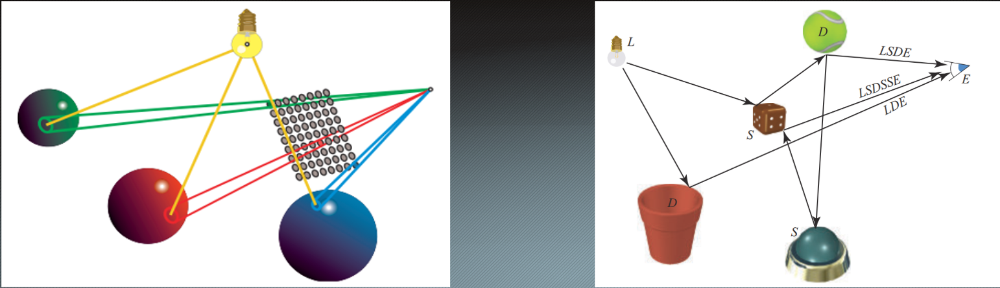

局部光照与全局光照

局部光照模型只关心直接光照部分，即直接从光源发出并照射到物体表面并反射至摄像头的光线

一般将局部光照模型分为四个部分
**漫反射**

**高光反射**

**环境光**

自发光

## 漫反射

在光照模型的定义中，当光线从光源照射到模型表面时，光线均匀被反射到各个方向，并且被物体吸收了部分能量，因此改变了颜色和方向。这种现象就是漫反射。

漫反射光照符合Lambert定律，反射光强与**法线**和**点到光源方向**之间的夹角的余弦值成正比

理论分析（Radiometry）：

Radiant Flux（辐射通量）：光源每秒发出的能量，常称为亮度

Irradiance：单位面积接受来自所有方向的Flux的和

记Flux为P，面积为A，Irradiance为E

对于光源垂直射到面上时，有E1= P / A1

若光以某个角度照射该平面，则有E2=P / A2

若从面积角度理解，从A1到A2有接受面积上的变化，且

cosθ = A1 / A2

故有E2 = P / A2 = P / A1 * cosθ = E1 * dot（n，L）

从光线角度分析，可认为只有垂直于表面的光才被算作有效光，故对光线做分解

得到垂直方向上的辐射通量P2 = P *cosθ ，与上式结果相同

得到

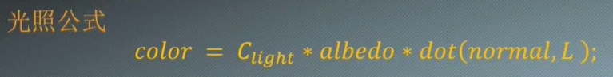

Clight：入射光颜色

albedo：模型漫反射的材质（颜色）

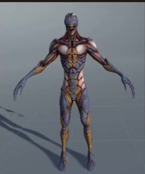

## 镜面反射（高光反射）

当光线到达物体表面并发生了反射，观察视线在反射光线的附近时，便能够观察到了高光反射

高光反射描述了光线在物体表面发生的反射(光强不变，方向改变)，反射率根据菲涅尔效应决定

**通常使用对应的反射贴图描述物体表面的反射率，并且使用光泽度(粗糙度，反光度)描述高光范围的大小。**

公式：

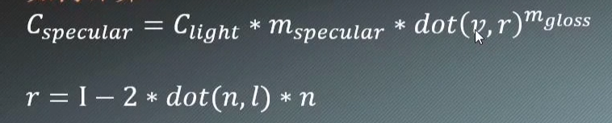

mgloss：材质光泽度（反光度），描述高光的范围，越大高光衰减越快，范围越小

mspecular：高光反射的材质（高光反射系数）

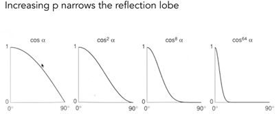

 

光泽度对cos函数值的影响，指数越大使得cos越往小范围分布

光泽度对亮度分布的影响

实际效果对比

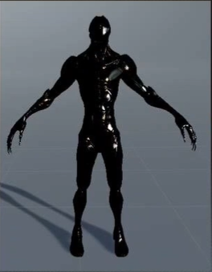

## 环境光

光源直射到物体上是直接光照，而从其它物体反射过来的光则被称为间接光照，为了处理间接光照，引入了环境光

经验模型中认为一个场景中的环境光是一定的，因为其通常很微弱

公式：

​	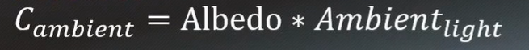

Albedo：即漫反射材质（系数），因为假设来自所有方向的环境光是均匀的

Ambient light：环境光

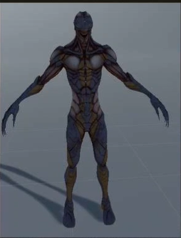

## 自发光

物体自身发出的光线

一般使用一张发光贴图显示物体的自发光

**在结合以上四种光线后：**

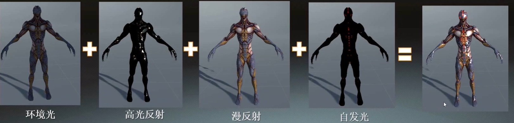

## Lambert模型

即Lambert余弦定理的应用，使用漫反射公式计算光照

## Phong模型

在漫反射的基础上，加上环境光与高光反射

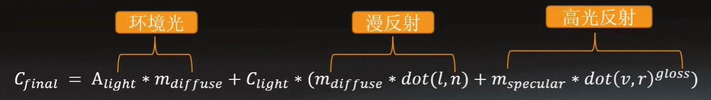

## Blinn-Phong模型

在Phong模型的基础上，对高光反射部分作出改进，使用半程向量计算余弦值

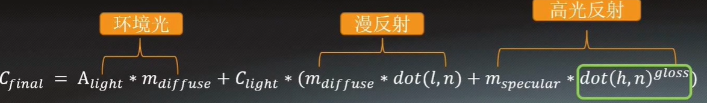

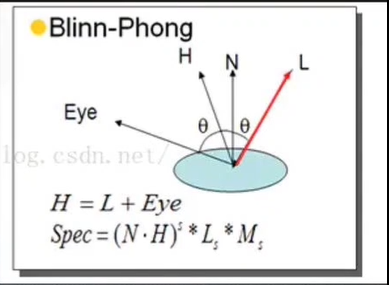

使用半程向量的好处：

1.步骤少，效率提升

2.当高光的部分反射向量与摄像机方向夹角超过90度时（入射光与摄像机方向在法线同一侧），该部分会被忽略，而半程向量与法线间的夹角不超过90度，可以解决Phong模型的这一问题

坏处：

使用半程向量计算只是为了提升计算效率，是一种效果逼近的模拟，实际效果比使用反射向量计算差一些

## Gourand模型

Gourand模型以顶点为单位计算光量，再通过插值得到每个像素点的光亮度。

在表现物体光滑性上有比较好的表现，但当值不再是线性变化的时候，比如镜面高光（通过余弦值的幂次方衰减），由于线性插值导致内插值不可能大于顶点值。因此高光只能出现在顶点。

由于使用的颜色插值，会导致镜面高光蔓延到周边

左：Gourand模型 右：Blinn-Phong模型

## Flat模型

平面着色模型，以多边形为单位计算光照强度。

每个三角形的所有顶点法线取为该面的法线方向。故一个多边形的所有点分享相同的光强度值。通常适用于lowPoly风格的场景

## 四种模型总结

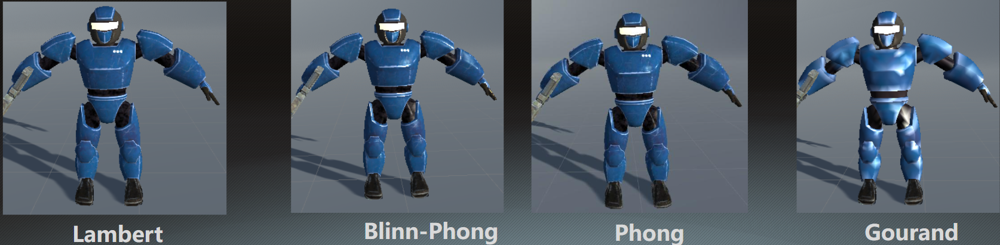

- Lambert模型只考虑表面的漫反射部分
- Phong模型能够较好的呈现镜面高光的效果，也是四种模型中最接近真实的效果，需要计算较复杂的反射向量
- Blinn-Phong模型效果与Phong模型相近，更偏向艺术性的效果，使用方便计算的半程向量代替较为复杂的反射向量，计算量小于Phong，是效果和效率的最佳选择，也是大多数情况下的默认光照模型
- Gourand模型计算顶点光照并通过增量法插值计算多边形内部的光强，当顶点密度低时，表现效果很差，对于高光的效果也不尽如意，计算量较小

