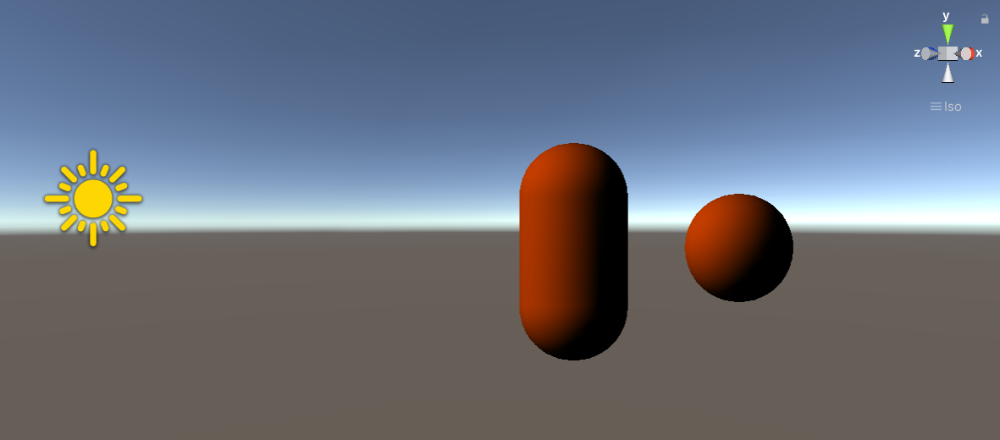
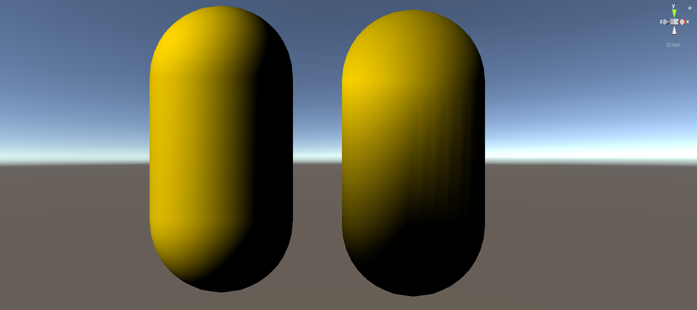
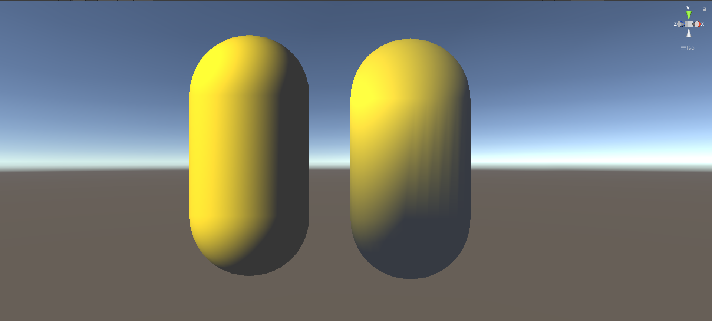
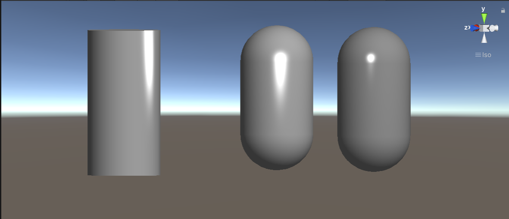
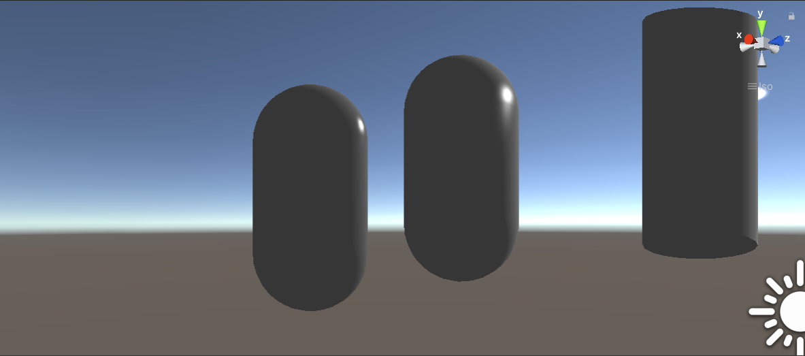

# 使用Unity Shader Lab编写Blinn-Phong光照模型


# 实现漫反射


//逐顶点

```


Shader "vert"
{
	Properties
	{
		_Diffuse("Diffuse Color", Color) = (1,1,1,1)
	}
	SubShader
	{
		
		Pass
		{
			Tags{"LightMode"="ForwardBase"}

			CGPROGRAM
			#include"Lighting.cginc"  
			#pragma vertex vert
			#pragma fragment frag

			fixed4 _Diffuse;
			struct a2v
			{
				float4 vertex : POSITION;
				float3 normal : NORMAL;
			};
			
			struct v2f
			{
				float4 position : SV_POSITION;
                fixed3 color : COLOR0;
			};
			
			v2f vert(a2v v)
			{
				v2f f;
				f.position = UnityObjectToClipPos( v.vertex );
				fixed3 normalDir = normalize(UnityObjectToWorldNormal(v.vertex));
				fixed3 lightDir = normalize(_WorldSpaceLightPos0.xyz);  
                fixed3 diffuse = _LightColor0.rgb * _Diffuse.rgb * max(0 , dot(normalDir , lightDir)) ;
				f.color = diffuse;
				return f;
			}
			fixed4 frag(v2f f) : SV_Target
			{
    			return fixed4(f.color ,1);  
			}
			ENDCG
		}
	}
}
```





//逐像素

```


Shader "frag"
{
	Properties
	{
		_Diffuse("Diffuse Color", Color) = (1,1,1,1)
	}
	SubShader
	{
		
		Pass
		{
			Tags{"LightMode"="ForwardBase"}

			CGPROGRAM
			#include"Lighting.cginc"  
			#pragma vertex vert
			#pragma fragment frag

			fixed4 _Diffuse;
			struct a2v
			{
				float4 vertex : POSITION;
				float3 normal : NORMAL;
			};
			
			struct v2f
			{
				float4 position : SV_POSITION;
                float3 worldNormalDir : COLOR0;
			};
			
			v2f vert(a2v v)
			{
				v2f f;
				f.position = UnityObjectToClipPos( v.vertex );
				
				f.worldNormalDir = UnityObjectToWorldNormal(v.normal);
				return f;
			}
			fixed4 frag(v2f f) : SV_Target
			{
				
				fixed3 normalDir = normalize(f.worldNormalDir);
				fixed3 lightDir = normalize(_WorldSpaceLightPos0.xyz); 
                fixed3 diffuse = _LightColor0.rgb * _Diffuse.rgb * max(0 , dot(normalDir , lightDir)) ;
				fixed3 color = diffuse;
    			return fixed4(color ,1);  
			}
			ENDCG
		}
	}
}
```




<center>逐像素与逐顶点对比


可以看到，逐像素明显“平滑许多”，因为逐顶点时，顶点之间的颜色是通过线性插值的方法计算出来的，当计算非线性光照（高光反射）时，顶点光照就会出现问题，且渲染图元之间的颜色总是低于顶点处的颜色值，有时会有明显的棱角现象


但使用逐像素花费的性能会高很多


# 加入环境光（逐像素）

```
fixed3 ambient = UNITY_LIGHTMODEL_AMBIENT.rgb;
f.color = diffuse + ambient;
```





# 加入高光反射（逐像素）

```
// Upgrade NOTE: replaced '_World2Object' with 'unity_WorldToObject'


Shader "frag"
{
	Properties
	{
		_Diffuse("Diffuse Color", Color) = (0.8,0.8,0.8,1)
		_Specular("Specular Color", Color) = (1,1,1,1)
		_Gloss("Gloss", Range(0,200)) = 10
	}
	SubShader
	{
		
		Pass
		{
			Tags{"LightMode"="ForwardBase"}

			CGPROGRAM
			#include"Lighting.cginc"  
			#pragma vertex vert
			#pragma fragment frag

			fixed4 _Diffuse;
			fixed4 _Specular;
			half _Gloss;
			struct a2v
			{
				float4 vertex : POSITION;
				float3 normal : NORMAL;
			};
			
			struct v2f
			{
				float4 position : SV_POSITION;
                float3 worldNormalDir : COLOR0;
				float3 worldVertex : TEXCOORD1;
			};
			
			v2f vert(a2v v)
			{
				v2f f;
				f.position = UnityObjectToClipPos( v.vertex );
				f.worldNormalDir = UnityObjectToWorldNormal(v.normal);
				f.worldVertex = mul(unity_ObjectToWorld, v.vertex).xyz;
				return f;
			}
			fixed4 frag(v2f f) : SV_Target
			{
				fixed ambient = UNITY_LIGHTMODEL_AMBIENT.rgb *_Specular.rgb;

				fixed3 normalDir = normalize(f.worldNormalDir);
				fixed3 lightDir = normalize(_WorldSpaceLightPos0.xyz); 
                fixed3 diffuse = _LightColor0.rgb * _Diffuse.rgb * max(0 , dot(normalDir , lightDir)) ;
				//Blinn-Phong模型，使用半程向量
				fixed3 reflectDir = normalize(reflect(-lightDir , normalDir));
				fixed3 viewDir = normalize(_WorldSpaceCameraPos.xyz - f.worldVertex);
				fixed3 specular = _LightColor0.rgb * _Specular.rgb *pow(max(0 , dot(reflectDir,viewDir) ) ,_Gloss );

				fixed3 color = diffuse + ambient +specular ;
    			return fixed4(color ,1);  
			}
			ENDCG
		}
	}
}
```




<center>左圆柱体Gloss > 右圆柱体侧Gloss




<center>背面效果

可以看到，背面的光照太暗，使用兰伯特模型计算漫反射还是不太理想

