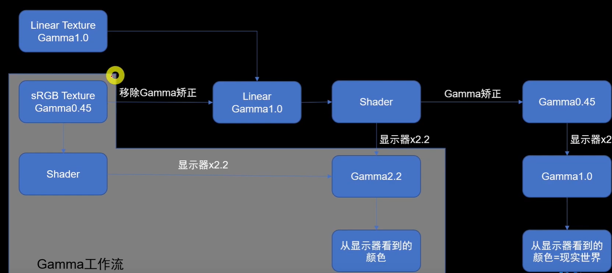

# Gamma矫正

## 概念

对线性三色值和非线性视频信号之间进行编码和解码的操作

传递函数

OETF：光转电传递函数，负责把场景线性光转到非线性视频信号值

EOTF：电转光传递函数，负责把非线性视频信号值转换成显示光亮度

公式：

gamma编码后亮度提升，解码后亮度下降

- 图像经过gamma编码存储在硬盘中，将获取到的物理数据做一次gamma值约为0.45的映射，这样的过程叫做 gamma编码。 

- 在显示图像时，需要将每个像素做一次gamma值约为2.2的矫正，使最终的结果为正确的物理数据。

## 为什么要使用非线性的方式存储亮度？

非线性转换的目的主要是为了优化存储空间和带宽，传递函数能够更好地帮我们利用编码空间。

用于显示图像的数据大小都是8bit，而人眼对暗部变化更敏感。如果要充分利用带宽，那么就需要使用更多位置去存储暗部值。也就是说暗部使用更高精度保存，而亮部使用更低精度保存。  

实际上，下面的亮度变化才是均匀的

作映射后得到的gamma曲线，暗度部分变化明显更加陡峭

韦伯定律：

感觉的差别阈限随原来刺激量的变化而变化，而且表现为一定的规律性，用公式来表示，就是△Φ/Φ=C，其中Φ为原刺激量，△Φ为此时的差别阈限，C为常数，又称为韦柏率

简单来说就是，当所受刺激越大时，需要增加的刺激也要足够大才会让人感觉到明显变化，但是只适用于中等强度的刺激

总结：

1.人眼对暗部变化比亮部更加敏感

2.我们目前所使用的真彩格式RGBA32，每个颜色通道只有8位用于记录信息，为了合理使用带宽和存储空间，需要进行非线性转换。

3.目前我们所普遍使用的sRGB颜色空间标准，他的传递函数gamma值为2.2(2.4)

# 线性工作流

在生产的各个环节，正确使用gamma编码及gamma解码，使得最终得到的颜色数据与最初输入的物理数据一致

如果是使用Gamma空间的贴图，在传给着色器前需要从Gamma空间转到线性空间，使着色器渲染时使用的是线性空间的颜色值

## Unity中的颜色空间

当选择Gamma Space时，Unity不会做任何处理

当选择Linear Space时，引擎的渲染流程在线性空间计算，理想情况下项目使用线性空间的贴图颜色，不需要勾选sRGB，如果勾选了sRGB的贴图，会通过硬件特性采样时进行线性转换。

硬件特性支持：

主要由两个硬件特性来支持：

 sRGB Frame Buffer

- 将Shader的计算结果输出到显示器前做Gamma校正
- 作为纹理被读取时会自动把存储的颜色从sRGB空间转换到线性空间
- 调用ReadPixels()、ReadBackImage()时,会直接返回sRGB空间下的颜色
- sRGB Frame Buffer只支持每通道为8bit的格式，不支持浮点格式
- HDR开启后会先把渲染结果绘制到浮点格式的FB中，最后绘制到sRGB FB上输出。

​      

sRGB Sampler

​      将sRGB的贴图进行线性采样的转换。

使用硬件特性完成sRGB贴图的线性采样和shader计算结果的gamma校正，比起在shader里对贴图采样和计算结果的校正要快

Substance Painter

当Substance的贴图导出时，线性的颜色值经过伽马变换，颜色被提亮了，所以需要在Unity中勾选sRGB选项，让它在采样时能还原回线性值

PhotoShop

如果使用线性空间，一般来说Photoshop可以什么都不改，导出的贴图只要勾上sRGB就可以了

如果调整PhotoShop的伽玛值为1使之变为线性空间中的值，导出的贴图在Unity中也不需要勾选sRGB了

PhotoShop对颜色管理特别精确，Unity里看到的颜色要经过显示器的伽玛变换，而PhotoShop不会，PhotoShop会读取显示器的Color Profile，反向补偿回去

PhotoShop有第二个Color Profile，叫做Document Color Profile。通常它的默认值就是sRGB Color Profile，和显示器的Coor Profile一致，颜色是被这个Color Profile压暗了，所以PhotoShop中看到的结果才和Unity中一样。

Unity中的混合是线性混合，而Photoshop的图层和图层之间做混合的时候，每个上层图层都经过了伽马矫正，然后做混合。在设置中更改，选择“用灰度系数混合RGB颜色”，参数设置为1，这样图层才是直接混合的结果

