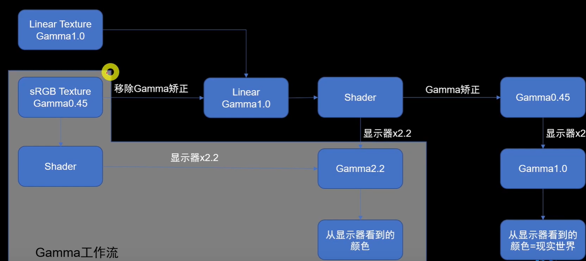
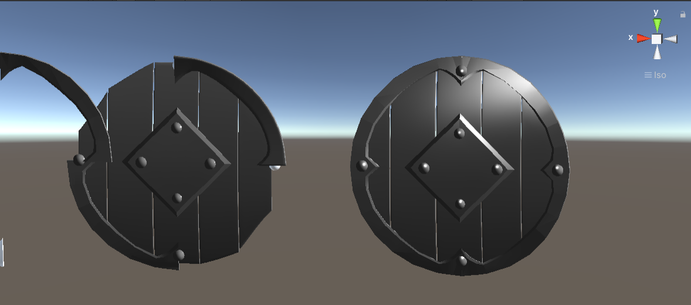
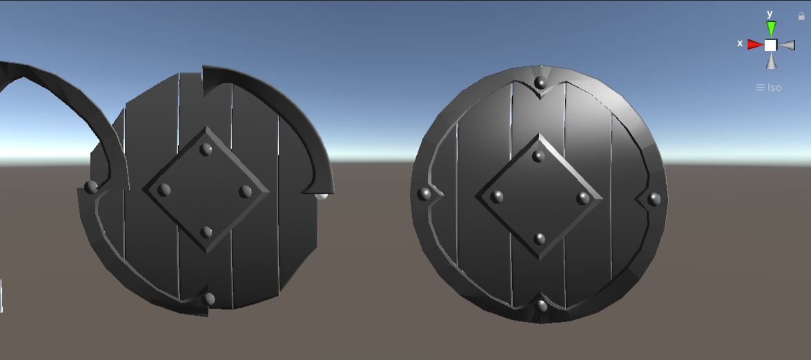
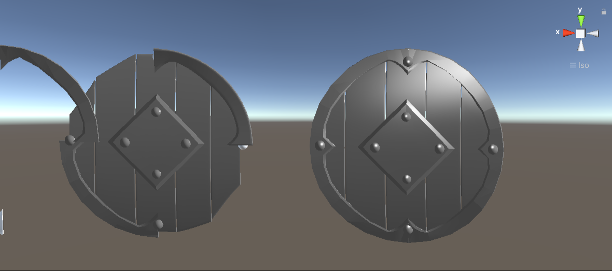

# Unity中的Linear Space和Gamma Space


unity中有线性工作流和gamma工作流两种颜色计算方式





**使用2.4所写的Blinn-Phong模型，并加入基础纹理**


Gamma空间（Unity设置实现）：




<center>3ds Max自己做的盾牌，不知道为什么另一个零件分离了.......

​    

Linear空间（Unity设置实现）：




Gamma空间下的线性计算（通过Shader代码手动实现线性计算）



```
Shader "frag"
{
	Properties
	{
		_Diffuse("Diffuse Color", Color) = (0.8,0.8,0.8,1)
		_Specular("Specular Color", Color) = (1,1,1,1)
		_Gloss("Gloss", Range(0,200)) = 10
		_MainTex("Main Tex", 2D) = "whilte"{}
	}
	SubShader
	{
		
		Pass
		{
			Tags{"LightMode"="ForwardBase"}

			CGPROGRAM
			#include"Lighting.cginc"  
			#pragma vertex vert
			#pragma fragment frag

			fixed4 _Diffuse;
			fixed4 _Specular;
			half _Gloss;
			sampler2D _MainTex;
			float4 _MainTex_ST;
			struct a2v
			{
				float4 vertex : POSITION;
				float3 normal : NORMAL;
				float4 texcoord : TEXCOORD;
			};
			
			struct v2f
			{
				float4 position : SV_POSITION;
                float3 worldNormalDir : COLOR0;
				float3 worldVertex : TEXCOORD1;
				float2 uv : TEXCOORD2;
			};
			
			v2f vert(a2v v)
			{
				v2f f;
				f.position = UnityObjectToClipPos( v.vertex );
				f.worldNormalDir = UnityObjectToWorldNormal(v.normal);
				f.worldVertex = mul(unity_ObjectToWorld, v.vertex).xyz;
				f.uv = TRANSFORM_TEX(v.texcoord , _MainTex);
				//f.uv = v.texcoord.xy * _MainTex_ST.xy + _MainTex_St.zw
				return f;
			}
			fixed4 frag(v2f f) : SV_Target
			{
				fixed3 normalDir = normalize(f.worldNormalDir);
				fixed3 lightDir = normalize(_WorldSpaceLightPos0.xyz); 
				//纹理值
				fixed3 albedo = tex2D(_MainTex, f.uv).rgb ;
				albedo = GammaToLinearSpace(albedo);
				//此处也可近似使用 pow(albedo , 2,2F)
                fixed3 diffuse = _LightColor0.rgb * albedo * max(0 , dot(normalDir , lightDir)) ;
				fixed ambient = UNITY_LIGHTMODEL_AMBIENT.rgb *albedo;
				//Blinn-Phong模型，使用半程向量
				fixed3 viewDir = normalize(_WorldSpaceCameraPos.xyz - f.worldVertex);
				fixed3 halfDir = normalize(lightDir + viewDir);
				fixed3 specular = _LightColor0.rgb * _Specular *pow(max(0 , dot(halfDir , normalDir) ) ,_Gloss );

				fixed3 color = diffuse + ambient +specular ;
				color = LinearToGammaSpace(color);
    			return fixed4(color ,1);
			}
			ENDCG
		}
	}
}
```

